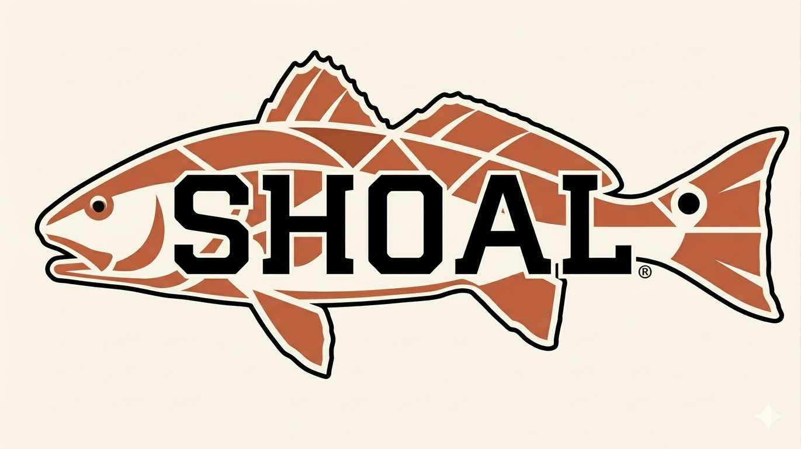

<div align="center">



**Scale headless browsers like a school of fish.**

[](https://github.com/we-be/shoal/actions/workflows/ci.yml)
[](https://go.dev)
[](LICENSE)
[](https://github.com/we-be/shoal/releases)

| CF solve | Minnow latency | Parallel speedup | Success rate |
|:--:|:--:|:--:|:--:|
| **< 1s** | **~0.2s** | **4.7x** | **10/10** |

</div>

---

Shoal separates **orchestration** from **automation**. One Chrome grouper solves Cloudflare, then a school of minnows ride the earned cookies for fast parallel scraping.

```
              ┌─────────────┐
 clients ────▶│  Controller │  pool, leases, warm matching, cookie handoff
              └──────┬──────┘
                     │
     ┌───────────────┼───────────────┐
     ▼                               ▼
┌──────────┐   cf_clearance    ┌───────────────┐
│ Grouper  │ ─────────────────▶│    Minnows    │
│ (Chrome) │   auto-handoff   │  (tls-client)  │
│  heavy   │                  │    light x N   │
└──────────┘                  └───────────────┘
```

## Quick Start

```bash
make build
make school-cf COUNT=10        # 1 grouper + 10 minnows
make school-lp COUNT=5         # 5 lightpanda (JS, no CF)
make school-minnow COUNT=20   # 20 tls-client (HTTP only)
make school-mixed              # 2 lightpanda + 5 minnows
make stop
```

Dashboard at `localhost:8180/dashboard`. Metrics at `localhost:8180/metrics`.

## Client Libraries

### Go

```go
import "github.com/we-be/shoal/pkg/shoal"

client := shoal.NewClient("http://localhost:8180")

// One-liner
resp, _ := client.Fetch(ctx, "https://example.com", "my-scraper")

// With options
resp, _ = client.Fetch(ctx, url, "scraper",
    shoal.WithClass("heavy"),
    shoal.WithCaptureXHR("api/v1"),
)

// Manual lease control
lease, _ := client.Lease(ctx, "scraper", "example.com")
resp, _ = client.Navigate(ctx, lease.LeaseID, url)
client.Release(ctx, lease.LeaseID)
```

### Python

```python
from shoal import Shoal

s = Shoal("http://localhost:8180")

# One-liner
resp = s.fetch("https://example.com")

# Session (auto release)
with s.session("my-scraper", "example.com") as session:
    page = session.get("https://example.com/data")
    print(page.json())
```

## API

```bash
# Simple one-shot (auto lease/release)
curl -X POST localhost:8180/fetch \
  -d '{"url": "https://example.com", "consumer": "my-scraper"}'

# Manual lease lifecycle
curl -X POST localhost:8180/lease \
  -d '{"consumer": "my-scraper", "domain": "example.com"}'
curl -X POST localhost:8180/request \
  -d '{"lease_id": "lease-abc", "url": "https://example.com"}'
curl -X POST localhost:8180/release -d '{"lease_id": "lease-abc"}'

# Browser actions
curl -X POST localhost:8180/request -d '{
  "lease_id": "lease-abc",
  "url": "https://example.com/login",
  "actions": [
    {"type": "fill", "selector": "#user", "value": "hunter"},
    {"type": "submit", "selector": "#form"}
  ]
}'

# Stateful multi-step (omit URL to stay on page)
curl -X POST localhost:8180/request -d '{
  "lease_id": "lease-abc",
  "actions": [{"type": "click", "selector": "#next"}]
}'

# XHR capture
curl -X POST localhost:8180/request -d '{
  "lease_id": "lease-abc",
  "url": "https://example.com/app",
  "capture_xhr": true,
  "capture_xhr_filter": "api/v1"
}'

# Force CF renewal
curl -X POST localhost:8180/renew -d '{"domain": "example.com"}'
```

## Backends

| Backend | Class | Flag |
|---------|-------|------|
| Chrome | heavy | `-backend chrome` |
| [Lightpanda](https://github.com/lightpanda-io/browser) | medium | `-backend lightpanda` |
| CDP (any) | medium | `-backend cdp -cdp-url ws://...` |
| tls-client | light | `-backend tls-client` |
| Stub | heavy | `-backend stub` |

## Proxy Support

Per-agent: `-proxy-url http://host:port -proxy-user user -proxy-pass pass`

Controller pool: `--proxy-file proxies.json` or `--proxy-api http://api/proxies`

## Identity & Warm Matching

Each agent gets a persistent lowcountry fish name (`redfish-a3b2`, `mullet-8d24`). The controller tracks cookies, CF clearance, and visit history per domain:

| Warmth | Meaning |
|--------|---------|
| 3 | Valid `cf_clearance` |
| 2 | Has cookies |
| 1 | Visited before |
| 0 | Cold |

## Reliability

- **Health checks** — dead agents removed after 3 missed polls
- **Lease TTLs** — abandoned leases auto-expire
- **Pool persistence** — JSON snapshots, survives controller restarts
- **Agent reconnection** — same address = same fish, cookies preserved
- **CF auto-renewal** — clearance refreshed before expiry
- **Cookie catch-up** — late-joining minnows get cookies on first lease
- **Tab cleanup** — leaked Chrome tabs closed after every navigation
- **AcquireWait** — clients can wait for an agent instead of getting rejected

## Configuration

All flags have `SHOAL_*` env var equivalents for container deployments. CLI flags take precedence.

## Docker

```bash
docker compose up  # 1 grouper + 3 minnows

# Or pull from ghcr.io
docker pull ghcr.io/we-be/shoal-controller:latest
docker pull ghcr.io/we-be/shoal-minnow:latest
docker pull ghcr.io/we-be/shoal-grouper:latest
```
